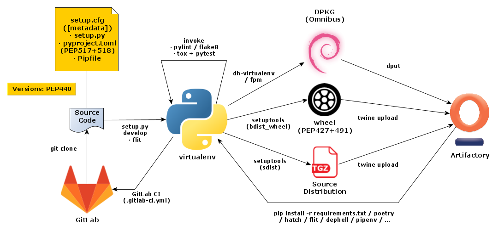

..  documentation: packaging

    Copyright (c) 2015 Jürgen Hermann

    Permission is hereby granted, free of charge, to any person obtaining a copy
    of this software and associated documentation files (the "Software"), to deal
    in the Software without restriction, including without limitation the rights
    to use, copy, modify, merge, publish, distribute, sublicense, and/or sell
    copies of the Software, and to permit persons to whom the Software is
    furnished to do so, subject to the following conditions:

    The above copyright notice and this permission notice shall be included in all
    copies or substantial portions of the Software.

    THE SOFTWARE IS PROVIDED "AS IS", WITHOUT WARRANTY OF ANY KIND, EXPRESS OR
    IMPLIED, INCLUDING BUT NOT LIMITED TO THE WARRANTIES OF MERCHANTABILITY,
    FITNESS FOR A PARTICULAR PURPOSE AND NONINFRINGEMENT. IN NO EVENT SHALL THE
    AUTHORS OR COPYRIGHT HOLDERS BE LIABLE FOR ANY CLAIM, DAMAGES OR OTHER
    LIABILITY, WHETHER IN AN ACTION OF CONTRACT, TORT OR OTHERWISE, ARISING FROM,
    OUT OF OR IN CONNECTION WITH THE SOFTWARE OR THE USE OR OTHER DEALINGS IN THE
    SOFTWARE.
    ~~~~~~~~~~~~~~~~~~~~~~~~~~~~~~~~~~~~~~~~~~~~~~~~~~~~~~~~~~~~~~~~~~~~~~~~~~~

*************************
Packaging Python Software
*************************

This is a how-to for developers with directions on packaging their software
in ways that enable a painless installation experience for end-users.
`Installing Python Software <installing.rst>`_ is the related end-user guide.

See also these other resources on the web…

* The `Python Packaging User Guide <https://packaging.python.org/>`_
* `The Hitchhiker’s Guide to Python! <http://docs.python-guide.org/>`_
* `The Sheer Joy of Packaging! <https://python-packaging-tutorial.readthedocs.io/en/latest/>`_ – A Scipy 2018 tutorial, also covering `Conda`

The following figure gives a rough outline of what tools are involved in the development workflow.
Regard services like GitLab and Artifactory as representatives,
you can equally well use any git server solution and e.g. `devpi` as your artifact repository.
There are also public services like GitHub, Travis, PyPI, and BinTray
that can fill these roles for open-source projects.

   Overview of Python Development Workflows

Packaging PyPI Releases
=======================

This is a short summary of essentals, consult the above resources for all the details.
It covers the ‘classic’ tool-chain, there are more ‘modern’ tools like ``poetry`` and
``flit`` that serve similar purposes.

Building with setuptools
------------------------

**TODO**

Packaging with wheel
--------------------

**TODO**

Uploading with twine
--------------------

Once you have your deployment artifacts ready (typically in a ``dist`` folder),
you can upload them to ``pypi.org``, or a local repository service.

There is a dedicated tool named `twine`_ for this.
It supports using SSL for transfers, and also allows you to *first* build your artifacts,
then test them as you see fit, and finally upload the *tested* artifacts.

Configuration is taken from ``~/.pypirc``, or the environment – especially useful for CI jobs.
A typical configuration might look like this:

.. code-block:: ini

    [distutils]
    index-servers = local pypi

    [local]
    repository: https://artifactory.local/artifactory/api/pypi/pypi-releases-local
    username: «USER»
    password: «API_TOKEN»

    [pypi]
    # repository: https://pypi.org/pypi
    username: «PYPI_USER»
    password: «PYPI_PWD»

You can select from the list of index servers by using ``twine upload -r «repo» …``,
the default is ``pypi``.

.. _`twine`: https://github.com/pypa/twine#readme

.. _build-zipapps:

Building Zipapps (PEP 441)
==========================

Running Python code directly from ZIP archives is nothing new,
`PEP 273 <https://www.python.org/dev/peps/pep-0273/>`_ made its debut in 2001,
as part of Python 2.3 in the form of the ``zipimport`` module..

`PEP 441 <https://www.python.org/dev/peps/pep-0441/>`_ builds on this and
describes mechanisms to bundle full applications into a single ZIP file
that can be made executable.
It was approved in 2015 and a first implementation appeared in Python 3.5 via the ``zipapp`` module.

See the PEP for details on how making a ZIP into an executable file works,
but basically on POSIX systems the Python interpreter is called in a ‘bang path’
that is followed by the ZIP archive. The interpreter recognizes the ‘script’
is a whole application archive and acts accordingly.
On Windows, zipapps *MUST* carry the ``.pyz`` extension which is bound to the ``py`` wrapper command,
which in turn looks at the bang path and calls a matching Python interpreter from the installed set.

To display the bang path of a zipapp, use this command::

    python3 -m zipapp --info foo.pyz

If you want to change the requested Python version to a newer one that is actually installed,
change the bang path as part of the installation process::

    python3 -m zipapp -p '/usr/bin/env python3.5' -o ~/bin/foo foo.pyz

This can also be done on an ad-hoc basis, by explicitly calling the desired interpreter::

    python3.5 foo.pyz …  # POSIX
    py -3.5 foo.pyz …  # Windows

Well-known tools to build new zipapps, outside of the Python core, are
`pex <https://github.com/pantsbuild/pex>`_ (Twitter) and
`shiv <https://github.com/linkedin/shiv>`_ (LinkedIn).
See their documentation for details on bundling your own applications,
and also the next section on PEX.

Packaging Python EXecutables (PEX)
==================================

`PEX files`_ are **P**\ ython **Ex**\ ecutable ZIP files, a format that contains
a full distribution of a Python application in a single archive
(just like exectable JARs for Java).
PEX files can be targeted at a specific platform and Python version,
but might also support multiple runtime environments.
See :ref:`pex-install` for details on how to use them,
and `PEP 441`_ for a formal description of the underlying mechanics and all the details.

The `Rituals`_ task library for `Invoke`_ offers a ``release.pex`` task
that performs all the necessary steps to create a PEX file.
If you want to do it ‘manually’ or integrate it into another task runner,
this is a concrete example:

.. code-block:: shell

    pex -r requirements.txt . -c nanny \
        -o bin/nanny-0.1.0.dev5-cp27-none-linux_x86_64.pex

At the time of this writing, you need to install ``pex 1.0.dev`` `directly from GitHub`_
for the above to work.

.. _`Rituals`: https://jhermann.github.io/rituals
.. _`Invoke`: http://www.pyinvoke.org/
.. _`PEX files`: https://youtu.be/NmpnGhRwsu0
.. _`PEP 441`: https://www.python.org/dev/peps/pep-0441/
.. _`directly from GitHub`: https://github.com/pantsbuild/pex
