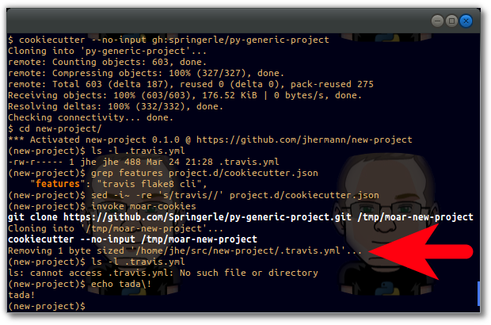

..  documentation: usage

    Copyright (c) 2015 Jürgen Hermann

    Permission is hereby granted, free of charge, to any person obtaining a copy
    of this software and associated documentation files (the "Software"), to deal
    in the Software without restriction, including without limitation the rights
    to use, copy, modify, merge, publish, distribute, sublicense, and/or sell
    copies of the Software, and to permit persons to whom the Software is
    furnished to do so, subject to the following conditions:

    The above copyright notice and this permission notice shall be included in all
    copies or substantial portions of the Software.

    THE SOFTWARE IS PROVIDED "AS IS", WITHOUT WARRANTY OF ANY KIND, EXPRESS OR
    IMPLIED, INCLUDING BUT NOT LIMITED TO THE WARRANTIES OF MERCHANTABILITY,
    FITNESS FOR A PARTICULAR PURPOSE AND NONINFRINGEMENT. IN NO EVENT SHALL THE
    AUTHORS OR COPYRIGHT HOLDERS BE LIABLE FOR ANY CLAIM, DAMAGES OR OTHER
    LIABILITY, WHETHER IN AN ACTION OF CONTRACT, TORT OR OTHERWISE, ARISING FROM,
    OUT OF OR IN CONNECTION WITH THE SOFTWARE OR THE USE OR OTHER DEALINGS IN THE
    SOFTWARE.
    ~~~~~~~~~~~~~~~~~~~~~~~~~~~~~~~~~~~~~~~~~~~~~~~~~~~~~~~~~~~~~~~~~~~~~~~~~~~

=============================================================================
Using the “py-generic-project” Template
=============================================================================

Preparations
------------

In case you don't have the ``cookiecutter`` command line tool yet,
here's `how to
install <https://github.com/Springerle/springerle.github.io#installing-the-cookiecutter-cli>`_
it.

For ``py-generic-project`` v1.2 and upwards, you need
at least ``cookiecutter`` v1.1, or v1.0 with degraded functionality –
for ``pipsi`` installs, just issue a ``pipsi upgrade cookiecutter``
command and you're done.

Project Creation
----------------

Creating a new Python project based on this template goes like this
(make sure you're in the directory you want your project added to):

::

    cookiecutter "https://github.com/Springerle/py-generic-project.git"

It's advisable to ``git add`` the created directory directly afterwards,
before any generated files are added, that you don't want to have in
your repository.

:bulb: \| To get *your* defaults for common template values
``cookiecutter`` will ask you for when you use a template, it makes
sense to have a
`~/.cookiecutterrc <https://github.com/jhermann/ruby-slippers/blob/master/home/.cookiecutterrc>`_
in your home directory. Follow the link to see an example. ---- \| :----

You should at least check these files regarding their content and adapt
them according to your needs:

-  ``project.d/classifiers.txt`` – Add the correct
   `categories <http://pypi.python.org/pypi?:action=list_classifiers>`_
   (a/k/a Trove classifiers) for your project.
-  ``requirements.txt`` – Add any Python packages you need for your
   project *at runtime*.

To bootstrap the project (as mentioned, best after ``git add``), use
these commands from within its directory:

::

    . .env --yes --develop
    inv ci | less -R
    "$(basename $(pwd))" --help

Feature Toggles
---------------

This template has a few options that can be turned on and off even after
initial creation, which the following terminal session demonstrates for
Travis CI support.

   Demo Terminal Session

At the moment of this writing, those feature are ``travis``, ``flake8``,
and ``cli``. See the ``features`` value in ``cookiecutter.json`` for a
current list.

Note that since the whole template is re-created, you should make sure
that you have no pending changes in your working directory, i.e.
everything is either safely committed or stashed away. After changing
``project.d/cookiecutter.json`` and the call to ``invoke moar-cookies``,
you should look at the diff, and ``git add`` any files that can just be
updated (e.g. typically ``.travis.yml``, ``setup.py``, and some others).

Files with considerable changes you have to merge manually, e.g. by
dumping a diff, resetting the affected files, reducing the diffs to the
changes you really want, and then applying the edited diff. Note that
the easiest way to do such a reset to the last commit is calling
``git stash && git stash drop``.

Another option is to work with two directories, i.e. clone a copy of
your project for the update process, perform the update, and then
selectively copy changes to your main working directory. There might be
a more stream-lined way applying some ``git`` magic, we'll see (ideas
are welcome). Still this is better than wading through commit logs to
catch up with an evolving template.
